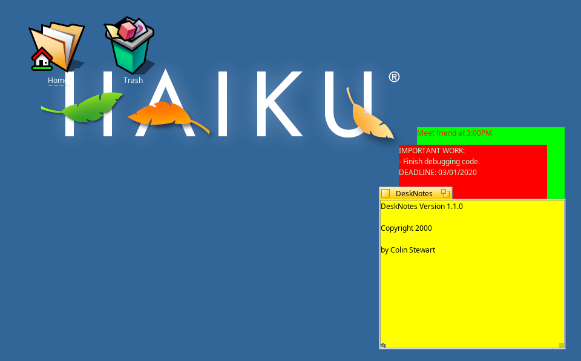

## DeskNotes
DeskNotes is a tool to put simple sticky notes on the Desktop.

It allows users to "stick" a note by creating Replicants that can be dragged to the Desktop.

You can also customize your notes by changing the notes' background and text colors.

